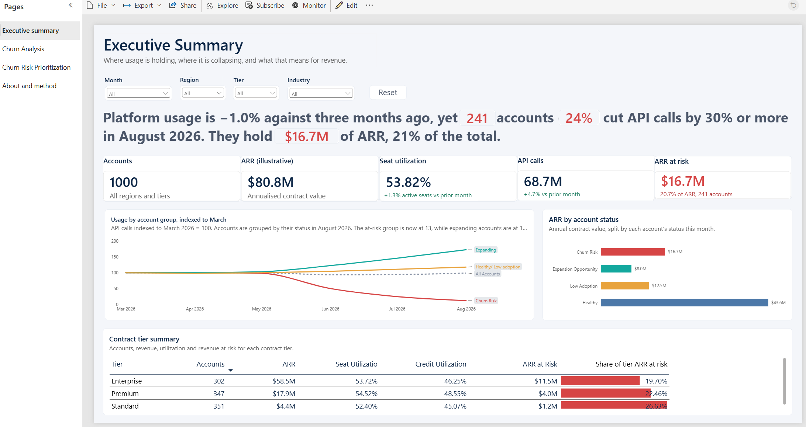
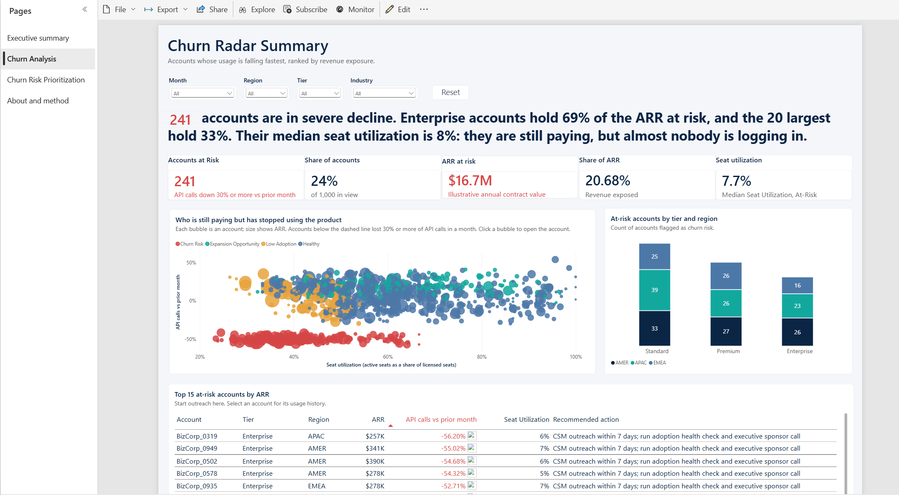
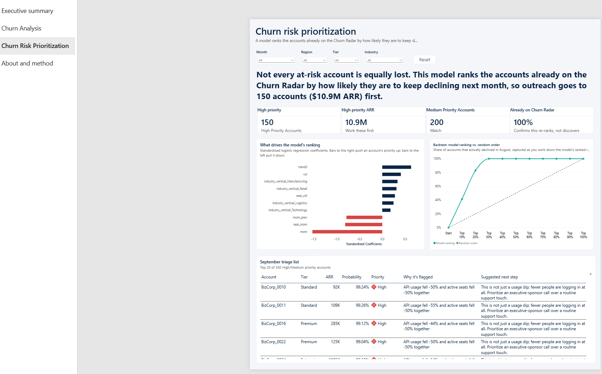
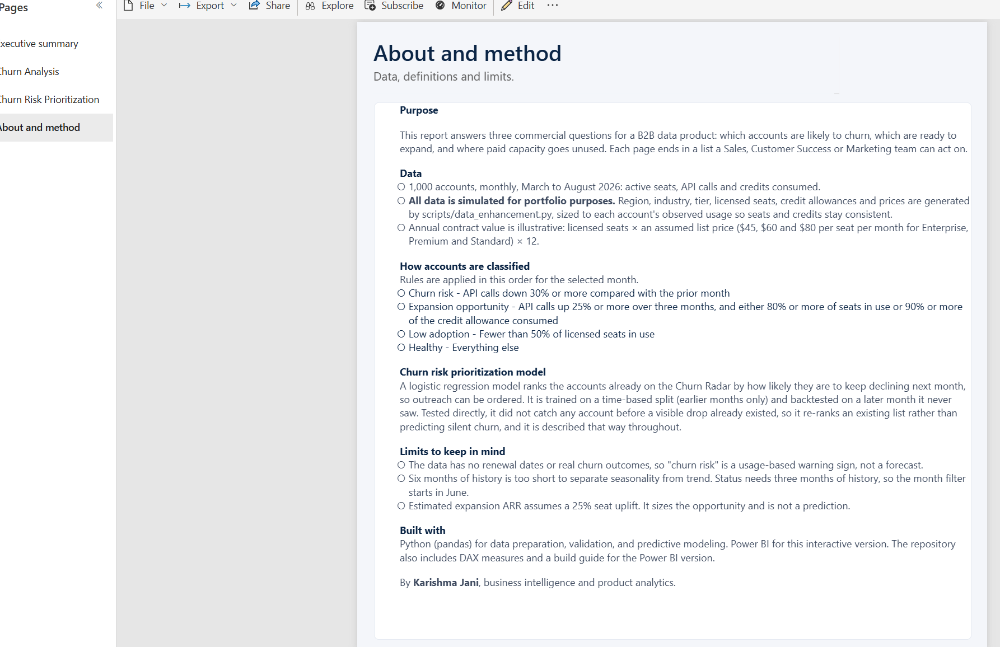

# B2B Product Health & Revenue Expansion Tracker

**Power BI | Python (pandas) | DAX | Product analytics**

An end-to-end product analytics project that turns monthly usage telemetry for **1,000 B2B accounts** into a clear answer to three commercial questions: **who is about to churn, who is ready to expand, and where is paid capacity going unused.**



The full report (`.pbix`) is in [`dashboards/BtoB Analyses_1000 accounts.pbix`](dashboards/B2B_Product_Health_Tracker.pbix), and a PDF export is in [`dashboards/`](dashboards/B2B_Product_Health_Tracker.pdf).

---

## Executive summary

Platform-level usage looks healthy. Underneath, the customer base is splitting in two.

| Finding | Evidence (latest month: Aug 2026) |
|---|---|
| **A flat topline hides a collapsing cohort.** | Total API volume is **-1.0%** vs 3 months earlier, yet **241 accounts (24%)** have fallen to about **13%** of their March usage. |
| **Revenue at risk is concentrated.** | Churn-risk accounts hold **$16.7M (21%)** of ARR. **65 Enterprise accounts carry 69%** of it, and the 20 largest accounts carry a third. |
| **Silent churn shows up in seats first.** | At-risk accounts use a median of **8%** of their licensed seats. They are still paying, but they have stopped using the product. |
| **A ready-to-buy group is being missed.** | **124 accounts** are growing fast (median +67% in 3 months) and near their seat or credit limit: **$8.0M** base ARR, **94** of them upgrade candidates outside the Enterprise tier. |
| **Capacity is going unused.** | **101 accounts** use under half of their licensed seats (**$12.5M** ARR). **75 accounts** already exceed their monthly credit allowance. |

**Recommended actions**

1. **Customer Success:** run a 7-day outreach on the 20 highest-ARR churn-risk accounts, starting with an adoption health check.
2. **Sales:** open upgrade conversations with the 124 expansion accounts *before* they hit overage or seat caps.
3. **Marketing / Enablement:** run an onboarding refresh for the 101 low-adoption accounts.
4. **Product Ops:** add "usage drop of 30% or more month over month" as a standing health alert.

---

## Business questions answered

- Which accounts are declining fast enough to be a churn risk, and how much revenue is exposed?
- Which accounts show growth plus capacity pressure, making them the best up-sell and cross-sell targets?
- Where are seats and credits going unused, and which customer segments are they in?
- What should Sales, Customer Success and Marketing do on Monday morning?

---

## The report

Four pages, all driven by the same month, region, tier and industry filters:

| Page | What it shows |
|---|---|
| **Executive summary** | A one-sentence headline that rewrites itself as filters change, KPI strip, the usage-index-by-cohort chart showing a flat topline hiding diverging groups, ARR by account status, and a contract-tier summary |
| **Churn analysis** | Seat utilization vs month-over-month usage change (bubble = ARR), at-risk accounts by tier and region, and the top 15 at-risk accounts with a recommended action |
| **Churn risk prioritization** | A logistic regression model ranks the accounts already flagged by likelihood of continued decline, so outreach is ordered instead of flat. Feature importance, a backtest lift chart, and a triage list with a plain-English reason and next step per account. See [below](#churn-risk-prioritization-model) |
| **About and method** | Data disclosure, status rules and limits |

<p align="center">
  
  
</p>
<p align="center">
  
</p>

Two custom visuals go beyond the base build: a risk heatmap and a bookmark-driven timeline.

---

## Churn risk prioritization model

The Churn Analysis page answers *who* is at risk with a reactive rule (usage down 30% or more). This adds a different question: **of the accounts already flagged, which ones are worth Customer Success time first?**

**What it is not, stated plainly:** an earlier version of this tried to predict churn *before* any warning sign appeared. Backtested directly, it caught **zero** accounts that weren't already visibly declining the month before - once usage starts falling in this dataset, it keeps falling in a smooth, persistent way (an account at 6,621 API calls falls to 3,146, then 1,608, then 803, roughly halving each month). Claiming "predicts churn before it happens" would not survive a follow-up question, so this project doesn't make that claim.

**What it is:** a **triage model**. Trained on a time-based split (May→Jun and Jun→Jul transitions) and backtested on a later transition (Jul→Aug) it never saw during training, a logistic regression ranks the 241 accounts already flagged by how likely they are to keep declining next month. Its backtest AUC is 1.00 on this dataset - a property of the clean, persistent decay pattern here, not a realistic production accuracy claim (see the caveat in `data/processed/model_metrics.json`). What generalizes is the **method**: a leak-free time-based validation, not the number.

**Why + what to do, per account.** A ranked list is only useful if someone can act on it, so each account gets a plain-English reason and a suggested next step generated from its own numbers - e.g. *"API usage fell -54% and active seats fell -67% together"* → *"This is not just a usage dip; fewer people are logging in at all. Prioritize an executive-sponsor call over a routine support touch."* This is generated from only 3 of the model's features (`mom`, `seat_mom`, `vol`); two others with large coefficients are deliberately excluded from this customer-facing text, and documented as such:
- `trend3` (API change vs 3 months ago) has a *positive* coefficient - recent growth nudges the model's risk score up for most accounts. Checked directly: for 406 of 407 accounts where it's the largest single contributor, the account is actually growing. That's a mean-reversion artifact of this dataset, not a real driver, so it's shown (correctly labelled) in the feature-importance chart but never used to tell a CSM *why* an account is flagged.
- `seat_util` and `credit_util` also have positive coefficients, which look backwards - low utilization should mean more risk, not less. Checked against the raw data: their correlation with decline is negative, as expected (-0.47, -0.39). The coefficient sign flips because both are collinear with `mom`/`seat_mom` (a classic suppressor-variable effect), which already carry the same signal cleanly.

| | |
|---|---|
| Backtest (Jul→Aug, held out) | AUC 1.00, precision 100% and recall 62% at the top 15% |
| September triage | 150 accounts high priority ($10.9M ARR), 100% already flagged by the reactive rule |
| Top model drivers (shown in chart) | Recent API decline and falling active seats decrease modeled risk most; usage volatility, Standard tier and a few industries increase it |
| Drivers used for customer-facing reasons | `mom`, `seat_mom`, `vol` only - the two exclusions above are checked against raw correlations, not just asserted |

Reproduce it: `python scripts/churn_prediction.py` (writes `predicted_risk_scores.csv`, `model_feature_importance.csv`, `model_backtest_lift.csv`, `model_metrics.json` to `data/processed/`).

---

## How accounts are classified

Each account is scored for the selected month. Rules apply in this order, and the thresholds are constants in the Python script and the DAX measures.

| Status | Rule | Accounts (Aug 2026) |
|---|---|---|
| **Churn risk** | API calls down **30% or more** vs the prior month | 241 |
| **Expansion opportunity** | API calls up **25% or more** vs 3 months earlier **and** (seats **80% or more** used **or** credits **90% or more** of allowance) | 124 |
| **Low adoption** | Active seats **under 50%** of licensed seats | 101 |
| **Healthy** | Everything else | 534 |

---

## Repository structure

```
├── README.md
├── requirements.txt
├── data/
│   ├── raw/
│   │   ├── monthly_usage.csv                 # Usage telemetry: 1,000 accounts x 6 months
│   │   └── dnb_reference_accounts.csv        # 100-account reference sample with firmographics
│   └── processed/
│       ├── enhanced_b2b_product_metrics.csv  # Fact table (6,000 rows) with firmographics added
│       ├── dim_account_snapshot.csv          # 1 row per account: status, MoM, recommended action
│       ├── churn_watchlist.csv               # GTM export: at-risk accounts, sorted by ARR
│       ├── expansion_targets.csv             # GTM export: expansion accounts, sorted by ARR
│       ├── predicted_risk_scores.csv         # Model output: continued-decline probability per account
│       ├── model_feature_importance.csv      # Model output: standardized coefficients (risk drivers)
│       ├── model_backtest_lift.csv           # Model output: decile capture rate, Jul->Aug backtest
│       └── model_metrics.json                # Model output: AUC, precision/recall, and the caveat
├── scripts/
│   ├── data_enhancement.py                   # Generates firmographics, scores accounts, QA checks
│   └── churn_prediction.py                   # Trains and backtests the prioritization model
├── docs/
│   └── dashboard_build_guide.md              # Page-by-page instructions for rebuilding the report
├── dax/
│   ├── measures.dax                          # DAX measures used in the report
│   └── measures_bulk_import.dax              # Same measures, formatted for DAX query view bulk import
├── dashboards/
│   ├── B2B_Product_Health_Tracker.pbix       # The Power BI report
│   ├── B2B_Product_Health_Tracker.pdf        # Static export of all four report pages
│   └── b2b_health_theme.json                 # Power BI theme in the same palette
└── screenshots/                              # README images
```

---

## Data

> **Disclosure:** all data in this repository is **simulated** for portfolio purposes. No real customer data is used.
> Firmographics, seat and credit limits, and pricing are generated by [`scripts/data_enhancement.py`](scripts/data_enhancement.py). Segment-level differences (region, industry) are therefore illustrative, not findings.

### Why the firmographics are not purely random

Assigning tier, seats and allowance independently of usage creates impossible rows (for example, a "Standard" account with 5 licensed seats and 300 active seats). Instead, the script **calibrates firmographics to observed usage**:

- Accounts in the 100-account reference sample keep their reference attributes.
- For the other 900, the contract tier is inferred from peak active seats (the rule matches the reference sample **96%** of the time), and licensed seats and credit allowance are sized from observed peak usage using the headroom ratios seen in the reference sample.
- The script asserts that **active seats never exceed licensed seats**, and the run is seeded (`SEED = 42`) so results are reproducible.

### Data dictionary: `enhanced_b2b_product_metrics.csv`

| Column | Description |
|---|---|
| `account_id`, `account_name` | Account key and display name |
| `usage_month` | First day of the usage month (Mar to Aug 2026) |
| `active_seats` | Users active in the month |
| `total_api_calls` | API calls in the month |
| `credits_consumed` | Credits consumed in the month |
| `global_region` | AMER / EMEA / APAC |
| `industry_vertical` | Financial Services, Healthcare, Logistics, Manufacturing, Retail, Technology |
| `contract_tier` | Enterprise / Premium / Standard |
| `total_licensed_seats` | Seats purchased (static per account) |
| `monthly_credit_allowance` | Credits included per month (static per account) |
| `annual_contract_value` | Illustrative ARR = licensed seats x list price x 12 (static per account) |
| `firmographic_source` | `Reference sample` or `Simulated` |

---

## Verification

The report's headline figures were checked against an independent pandas calculation on the same data (for example, 1,000 accounts, $80,765,220 ARR, 71,942,111 API calls and 241 at-risk accounts in August, and 243 / 242 / 241 accounts with a 30% or larger drop in June / July / August).

The DAX measures in [`dax/measures.dax`](dax/measures.dax) express this logic and are built out in [`dashboards/B2B_Product_Health_Tracker.pbix`](dashboards/B2B_Product_Health_Tracker.pbix); [`docs/dashboard_build_guide.md`](docs/dashboard_build_guide.md) lists the expected values they were checked against.

---

## Reproduce it

```bash
pip install -r requirements.txt
python scripts/data_enhancement.py      # data/processed/*.csv
python scripts/churn_prediction.py      # predicted_risk_scores.csv and other model outputs
```

Then open [`dashboards/B2B_Product_Health_Tracker.pbix`](dashboards/B2B_Product_Health_Tracker.pbix) in Power BI Desktop (free, no Pro license required to build or view a `.pbix` locally). [`docs/dashboard_build_guide.md`](docs/dashboard_build_guide.md) has the full page-by-page build instructions if you want to rebuild it from scratch, including validation checkpoints to confirm your numbers match.

---

## Assumptions and limitations

- **ARR is illustrative:** licensed seats x an assumed list price ($45 / $60 / $80 per seat per month for Enterprise / Premium / Standard) x 12.
- **Estimated expansion ARR** assumes a +25% seat uplift for the expansion cohort. It sizes the opportunity and is not a forecast.
- **Risk is a leading indicator based on usage.** The dataset has no contract renewal dates or real churn outcomes, so the model flags risk and does not predict churn.
- Only 6 months of history, so seasonality cannot be separated from trend. Status needs 3 months of history, so the month filter starts in June.

---

## Built with

Python (pandas, scikit-learn) for data preparation, validation and the churn prioritization model; Power BI and DAX for the report.

---

**Karishma Jani** - Business Intelligence & Product Analytics
[LinkedIn](https://linkedin.com/in/karishma-jani-070193158)
